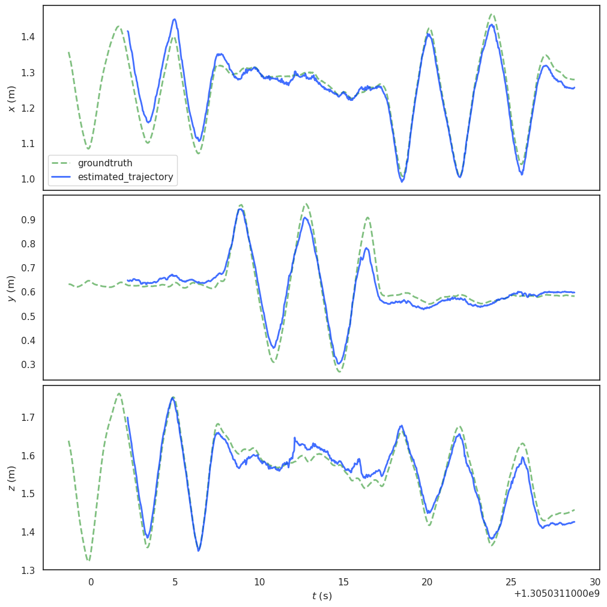
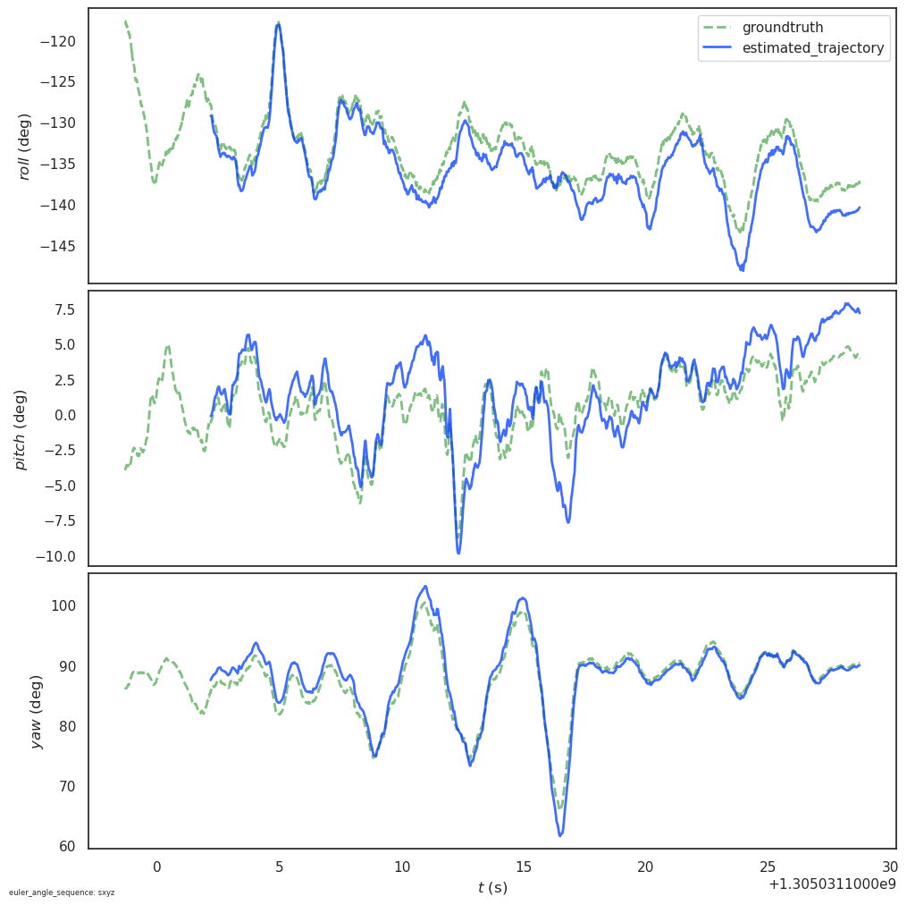

# Navio - RGB-D Visual Odometry

A frame-to-frame RGB-D Visual Odometry pipeline implemented in C++17 using Eigen and OpenCV, evaluated on the TUM RGB-D benchmark dataset.
---

## Trajectory Comparison

<p align="center">
  
  &nbsp;
  
</p>
<p align="center">
  <em> Translation trajectory (metres) &nbsp;&nbsp; Angular trajectory (degrees)</em>
</p>

> Pure frame-to-frame VO without loop closure or bundle adjustment.
> Results are competitive with published RGB-D VO baselines on this sequence.

## Results

Evaluated on the **TUM RGB-D fr1/xyz** sequence (792 frames, Freiburg 1 Kinect).

| Metric | Value |
|--------|-------|
| ATE RMSE | 0.049 m |
| ATE Mean | 0.046 m |
| RPE Translational RMSE | 0.072 m |
| RPE Rotational RMSE | 3.51 deg |

---
## Pipeline

```
RGB-D Frames
     │
     ▼
┌─────────────┐
│   Camera    │  Pinhole model, depth unprojection, distortion handling
└─────────────┘
     │
     ▼
┌─────────────┐
│    Frame    │  RGB + depth image container, point cloud generation
└─────────────┘
     │
     ▼
┌──────────────────┐
│ FeatureManager   │  ORB detection → Lowe ratio test → undistortion → 3D lifting
└──────────────────┘
     │
     ▼
┌──────────────────┐
│ MotionEstimator  │  solvePnPRansac → Rodrigues → SE(3) transform → inversion
└──────────────────┘
     │
     ▼
┌──────────────┐
│  Trajectory  │  SE(3) pose accumulation with aligned Eigen allocator
└──────────────┘
     │
     ▼
┌─────────────┐
│  Visualiser │  Real-time top-down trajectory rendering
└─────────────┘
```
---

## Dependencies

| Dependency | Version | Purpose |
|------------|---------|---------|
| CMake | 3.22+ | Build system |
| Eigen3 | 3.x | Linear algebra and SE(3) transforms |
| OpenCV | 4.x | Feature detection, image processing, PnP solver |
| yaml-cpp | 0.7+ | Camera parameter loading |

Install on Ubuntu:

```bash
sudo apt install cmake libeigen3-dev libopencv-dev libyaml-cpp-dev
```
---

## Build

```bash
git clone https://github.com/Fonyuy45/navio.git
cd navio
mkdir build && cd build
cmake ..
make -j4
```
---

## Dataset Setup

Download the TUM RGB-D fr1/xyz sequence:

```bash
wget https://cvg.cit.tum.de/rgbd/dataset/freiburg1/rgbd_dataset_freiburg1_xyz.tgz
tar -xzf rgbd_dataset_freiburg1_xyz.tgz
```
Associate RGB and depth timestamps:

```bash
python3 scripts/associate.py \
    rgbd_dataset_freiburg1_xyz/rgb.txt \
    rgbd_dataset_freiburg1_xyz/depth.txt \
    > rgbd_dataset_freiburg1_xyz/associated.txt
```
---

## Run

```bash
cd build
./navio
```

The pipeline will:
- Load camera intrinsics from `config/camera_params.yaml`
- Process all 792 associated RGB-D frame pairs
- Display a real-time top-down trajectory window
- Save the estimated trajectory to `results/estimated_trajectory.txt`

Press `q` to quit the visualisation window early.
---

## Evaluation

### TUM benchmark scripts

```bash
bash evaluate.sh
```

This runs both ATE and RPE evaluation against the fr1/xyz ground truth.

### evo framework

```bash
bash evaluate_evo.sh
```
Generates trajectory comparison plots using the [evo](https://github.com/MichaelGrupp/evo) evaluation framework.

---

## Camera Configuration

Camera intrinsics are loaded from `config/camera_params.yaml`. The default configuration uses the calibrated TUM Freiburg 1 RGB parameters:

To use a different camera, replace these values with your own calibration data.

---
---

## Key Implementation Details

**Undistortion before 3D lifting** — keypoints are undistorted using `cv::undistortPoints` before unprojection into 3D space. Depth lookup uses the original distorted pixel coordinates since the depth map is in the distorted camera frame. This single correction reduced ATE from 2.99m to 0.049m.

**RANSAC safeguards** - `solvePnPRansac` is wrapped with an inlier count check (minimum 15 inliers) and a physical sanity check rejecting implausible motions. Failed estimates return identity, treating the frame as zero motion rather than corrupting the trajectory.

**SE(3) pose inversion** - `solvePnP` returns a world-to-camera transform. The result is inverted before accumulation to obtain the camera-to-world transform required for trajectory building.

**Aligned Eigen allocator** - `std::vector<Eigen::Isometry3d>` uses `Eigen::aligned_allocator` to guarantee correct SIMD memory alignment for fixed-size Eigen types.

---
## Limitations

As a pure frame-to-frame VO system, Navio accumulates drift over time without correction. It does not implement:

- Keyframe selection
- Bundle adjustment
- Loop closure detection
- IMU fusion
- AI based feature detection and matching 

These are active research directions and natural extensions toward a full SLAM system.

---
## References

- Sturm et al., *A Benchmark for the Evaluation of RGB-D SLAM Systems*, IROS 2012
- Rublee et al., *ORB: An Efficient Alternative to SIFT or SURF*, ICCV 2011
- Barfoot, *State Estimation for Robotics*, Cambridge University Press

---

## Author

**Dieudonne F. YUFONYUY**
**Email: dieudonne.yufonyuy@gmail.com**

⭐ Star this repository if you found it helpful! 

Follow me for more updates!

## License

This project is licensed under the MIT License — see the [LICENSE](LICENSE) file for details.

```